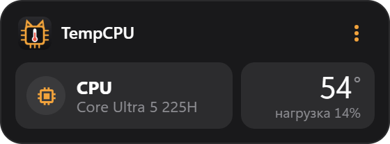

# TempCPU

<p align="center"></p>

Компактный виджет температуры процессора и видеокарты для рабочего стола Windows 10/11 в стиле
MeowsConvert, MeowsClock и MeowsNotes.

- Температура CPU (датчик «CPU Package») и нагрузка. Видеокарта показывается, если у неё есть датчик
  температуры (отдельные NVIDIA/AMD — да; встроенная графика Intel обычно нет).
- Поле подсвечивается жёлтым с 80 °C и красным с 90 °C (пороги меняются в меню).
- Виджет встроен в рабочий стол: не перекрывает программы и не прячется при «Свернуть всё»
  (Win+D, жест тремя пальцами). Перетаскивается за шапку, ширина — за левый/правый край
  (двойной клик по краю — стандартная ширина).
- Правый клик или `⋮`: частота обновления (1/2/5 с), пороги цветов, показывать нагрузку/видеокарту,
  поверх окон, прозрачность, вернуть в угол, автозапуск, скрыть. В трее — температура в подсказке.
- В шапке пишется что-то, только если данных нет.
- Место (и размер) виджета запоминаются относительно монитора: при подключении/отключении экрана, смене масштаба
  или разрешения виджет остаётся на своём мониторе, а не уезжает на соседний.

## Скачать

[Последний релиз](https://github.com/MrMe0ws/TempCPU/releases/latest) — Windows 10/11 x64:

- `TempCPU.Setup.X.Y.Z.exe` — установщик (ярлык на рабочем столе, удаление через «Приложения»);
- `TempCPU-X.Y.Z-portable.zip` — без установки: распаковать и запустить `TempCPU.exe`.

Файлы не подписаны, поэтому SmartScreen может предупредить о неизвестном издателе:
«Подробнее» → «Выполнить в любом случае».

## Откуда данные

Windows отдаёт температуру процессора только через драйвер ядра. Её читает бесплатная программа
[LibreHardwareMonitor](https://github.com/LibreHardwareMonitor/LibreHardwareMonitor) (с драйвером PawnIO),
а TempCPU берёт показания из её встроенного веб-сервера (`http://127.0.0.1:8085/data.json`) — сам виджет прав администратора не требует.

1. Установить LHM: `winget install LibreHardwareMonitor.LibreHardwareMonitor` (или кнопка «Установить» в виджете).
2. Нажать в виджете «Настроить и запустить» (или пункт меню «Настроить автозапуск LibreHardwareMonitor…»)
   и подтвердить UAC. Скрипт `scripts/setup-lhm.ps1`:
   - включает в LHM «запуск свёрнутым», «сворачивать в трей», «крестик сворачивает»;
   - создаёт задачу планировщика `LibreHardwareMonitor` — запуск при входе с правами администратора без UAC,
     в том числе от батареи;
   - запускает LHM.

## Запуск

```
npm install
npm start
```

## Сборка установщика

```
npm run dist
```

Установщик появится в `dist/`. Настройки — `%APPDATA%\TempCPU\settings.json`.
